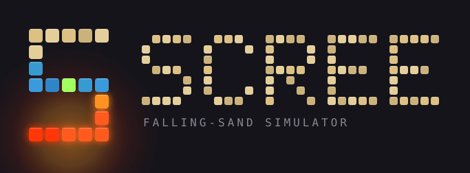
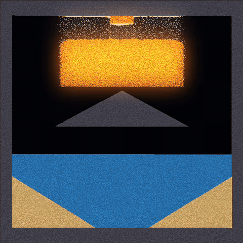
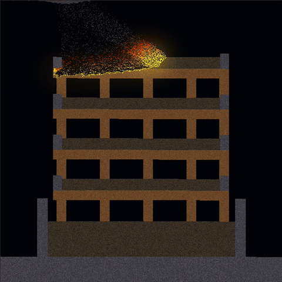
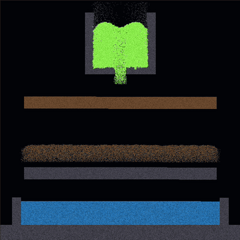
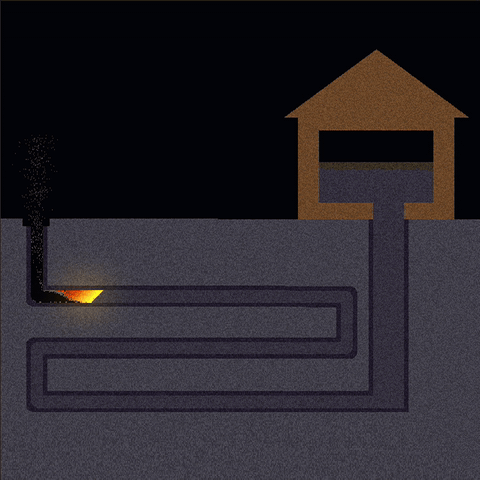
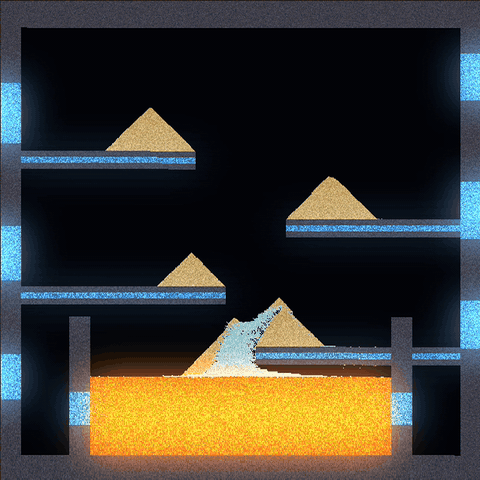
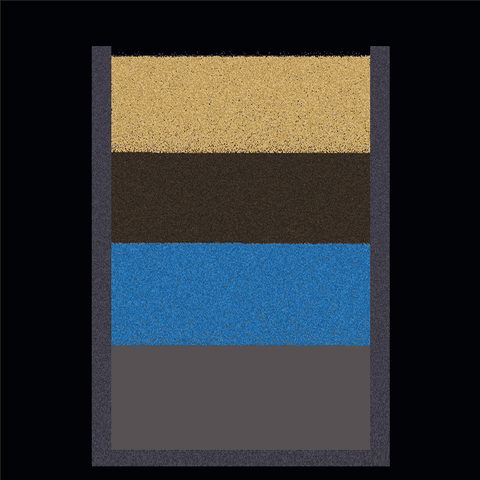
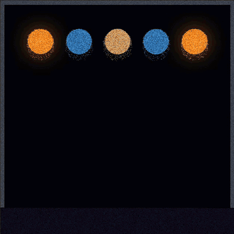
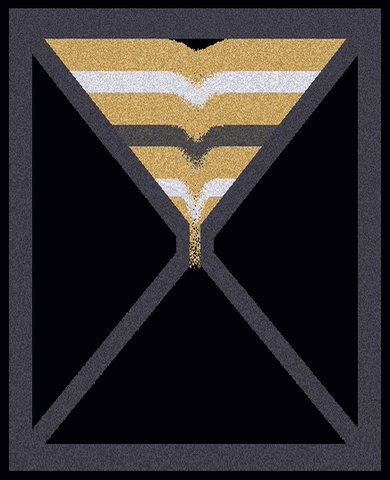

<p align="center">
  
</p>

*Scree — the sheet of loose rock fragments that mantles a slope.*

A falling-sand simulator written in C++20 with [raylib](https://github.com/raysan5/raylib).
Every pixel on the grid is an independent particle: sand piles up, water finds its
level, oil floats on top of it and burns, acid eats through stone, and lava that
touches water cools into fresh rock — or runs over sand and sets into glass. Salt
dissolves into brine that sinks under fresh water, plants creep through a pool until
it is all vine, and a spring fills the map on its own.

Materials are not hardcoded — they are defined in a JSON file that can be edited
and reloaded while the program is running, or built from scratch in the in-app
editor and saved back out as a file of your own.

<p align="center">
  
</p>

## Demo

| Fire bringing down a tower | Acid pouring through the shelves |
|:---:|:---:|
|  |  |
| **A fuse burning through a maze** | **Sand cascading down the shelves** |
|  |  |
| **A stack sorting itself by density** | **Five sources running at once** |
|  |  |

## Features

- **640 × 640 particle grid**, updated at 60 FPS with a configurable number of
  simulation steps per frame.
- **Chunk-based updating.** The grid is split into 32 × 32 chunks. A chunk that
  had no activity last frame is skipped entirely, and the scan jumps a full chunk
  width ahead. Chunks wake their neighbours when something moves across a border,
  so a settled pile costs nothing until you disturb it.
- **Data-driven materials.** Movement (density, gravity, scatter), lifespan, tags,
  colour and every reaction come from
  [`Game/assets/materials.json`](Game/assets/materials.json). Adding a material — or
  a new interaction between materials — is a JSON edit, not a code change.
- **Live reload.** Edit the JSON, press *RELOAD*, and the change is in the running
  simulation. Blocks already on the grid are remapped by name, so reordering the file
  or inserting a material keeps existing pixels intact; anything whose name
  disappeared becomes air. A malformed material is reported in the UI and dropped,
  and the rest of the file still loads instead of crashing.
- **In-app material editor.** Create a material, edit an existing one, or delete one
  without leaving the program. The panel covers everything the JSON does — colour
  range, emission, tag intensities and anchoring, lifespan and its on-death
  transitions, reactions with their weighted outcomes, and movement. The shipped
  materials are core and cannot be edited away; only the ones you added can be
  deleted, and deleting one wipes its blocks off the grid behind a confirmation.
- **Custom material files.** The registry loads the shipped
  [`materials.json`](Game/assets/materials.json) and, on top of it, an optional
  custom file picked through a native file dialog. It appears as a removable chip in
  the top bar, and *SAVE* writes everything you have added back out to a file of your
  own. Core materials stay untouched, so a custom file is an overlay, not a
  replacement — and if it is missing or malformed you get a warning, not a failed
  load.
- **Canvas save / load.** *SAVE CANVAS* writes the grid to a run-length encoded JSON
  file with a name palette; *LOAD CANVAS* reads one back. Because the palette stores
  names, a canvas loads against a different material set than the one that wrote it —
  anything the registry does not have becomes air and is named in the banner. Version
  and size mismatches are rejected before a single pixel is written.
- **Emission and bloom.** A material can declare an `emission` strength, which puts
  it into a separate emissive buffer that is blurred and composited back over the
  grid additively. Fire, lava, embers and hot stone glow at their own intensities and
  light bleeds past their edges. Toggle it from the bottom bar.
- **Density-based interaction.** Movement is decided by comparing densities rather
  than by special-casing pairs, so oil floats on water, water sinks through smoke,
  and anything heavier than a fluid sinks through it.
- **Data-driven reactions.** A material lists its reactions in JSON: a target (a
  specific material, or a tag like `flammable`), a chance, and weighted outcomes for
  the tile itself and for the neighbour it reacted with. Fire spreading to flammable
  neighbours, acid corroding into dirty water, and lava quenching into hot stone are
  all just JSON, not special cases in code.
- **Tags and anchoring.** Materials carry named tags with an intensity —
  `flammable`, `corrodible`, `wet`, `hot`, `matter` — so one reaction can target a
  whole class of materials while each material sets its own susceptibility. Nothing
  names water to put out a fire: fire, embers, hot ash and lava all react against
  `wet`, so brine, dirty water and mud quench just as well, and a new liquid gets it
  by tagging itself. A tag can also anchor: fire clings to flammable neighbours
  instead of drifting off before it has burnt them.
- **Lifespans.** A material can count down and transform when it expires, picking
  from a weighted list of outcomes — fire burning out into smoke or air, hot stone
  cooling back to stone. Colour can interpolate across the countdown, so fire fades
  as it dies. The tick can also be probabilistic — a material that only ages some of
  the time burns out ragged instead of a whole patch expiring in the same frame.
- **Liquid surface skimming.** Liquids on an open surface scan ahead for the
  nearest drop-off instead of shuffling one cell per step, so pools level out
  quickly rather than creeping.
- **Randomised scan order.** Each row is swept left-to-right or right-to-left at
  random, and falling particles scatter, which keeps piles from developing a
  directional bias.
- **Docked interface.** Fixed panels rather than floating windows: a top bar for the
  material file and run state, a left rail holding the material palette and the
  editor buttons, a bottom bar for the brush and the canvas. The whole chrome is
  tinted from one of seven colour themes, and the choice is saved next to the
  executable so it survives a restart.
- **Debug overlays.** Toggle the active-chunk grid to see what the simulation is
  actually working on, and a benchmark panel for per-stage frame timings. The left
  rail keeps a live count of loaded materials, live particles and awake chunks.

## Materials

| Material | Behaviour |
|---|---|
| Air | Empty space. Anything denser moves straight through it. |
| Sand | Falls and cascades into slopes. Dissolves slowly in acid. |
| Stone | Static. The default wall material. |
| Wood | Static and flammable. Burns away, and corrodes fast in acid. |
| Water | Levels out, puts out fire, and quenches lava into hot stone. |
| Dirty Water | What acid leaves behind once it has eaten something. Lighter than water, and quenches like it. |
| Oil | Floats on water and catches fire on contact. |
| Acid | Sinks through water, corrodes its neighbours, and turns to dirty water as it does. |
| Lava | Dense liquid. Ignites what it touches, melts sand into glass, and crusts into hot stone — occasionally obsidian — in water. |
| Fire | Rises, spreads to flammable neighbours, and dies against anything wet. |
| Smoke | Rises and fades out. Left behind by fire. |
| Steam | Rises and fades much faster. Boiled off water by hot stone. |
| Hot Stone | Freshly quenched lava. Cools into stone, boiling the water around it. |
| Ash | Falls like sand. What burnt wood leaves behind. Slowly soaks into dirt in water. |
| Hot Ash | Glowing ash from a fresh burn. Cools into ash. |
| Ember | Rises and drifts like fire but ages erratically, setting flammable things alight on the way up and dying in water. |
| Glow | Static and inert, and the brightest thing on the grid. A light source to build with. |
| Dirt | Falls like sand. Soaks up the water it touches and turns to mud. |
| Mud | Sluggish, heavy liquid. Dries back into dirt if it is left alone, and quenches fire while it is wet. |
| Plant | Static and flammable. Grows into any water it touches, so a sprig on a pool eventually fills it. Burns back off in one pass. |
| Seed | Falls like sand and sprouts into a plant where it lands in water or mud. |
| Salt | Falls like sand and dissolves into brine in water. Melts ice on contact. |
| Salt Water | Denser than fresh water, so it pools underneath instead of mixing. |
| Ice | Static. Melts into water next to anything hot, and to salt. |
| Snow | Piles like a light powder, and melts on anything hot or wet. |
| Gunpowder | Falls like sand and takes fire instantly, so a trail of it flashes end to end. |
| Molten Glass | Glowing liquid from lava running over sand. Sets into glass on its own, or the moment it hits water. |
| Glass | Static, pale and barely corrodible. What molten glass sets into. |
| Obsidian | Static, near-black, and the one material acid cannot touch. Thrown off where lava quenches. |
| Void | Static. Deletes whatever touches it and never fills up. A drain to build into the floor of a tank. |
| Water Source | Static. Emits water into the empty space around it, forever. |
| Sand Source | Static. Emits sand into the empty space around it, forever. |
| Lava Source | Static. Emits lava into the empty space around it, forever. |

## Controls

| Input | Action |
|---|---|
| **Left mouse** | Draw the selected material |
| **Right mouse** | Erase |
| **Mouse wheel** | Resize the brush (radius 1–100) |
| **Space** | Pause / resume |
| **C** | Clear the grid |
| **R** | Reload the material file |
| **1**–**9** | Select the first nine materials |

Dragging draws a continuous line between frames, so fast strokes don't leave gaps.
Drawing only fills empty space — erase first to replace something. The mouse is
ignored by the canvas while it is over a panel, and the hotkeys go quiet while a
text field has focus.

The rest is in the chrome around the grid:

| Panel | What it holds |
|---|---|
| **Top bar** | Theme picker, the loaded material files with *RELOAD* / *IMPORT* / *SAVE*, play / pause / step / clear, simulation steps per frame, frame rate |
| **Left rail** | The material palette, *+ NEW MATERIAL* / *EDIT SELECTED* / *DELETE SELECTED*, and readouts for loaded materials, live particles and awake chunks |
| **Bottom bar** | Brush size, *SAVE CANVAS* / *LOAD CANVAS*, and the bloom, chunk overlay and benchmark toggles |

Anything the loader has to report shows up in a banner under the top bar, coloured
by whether it was a warning or a failure, and stays until it is dismissed.

## How it works

The grid is stored as one flat row-major array of `Block`s — each an integer
material id, a colour, and a lifespan counter. Chunks are no longer containers:
a chunk is just the activity bookkeeping for a 32 × 32 square of pixels, kept as
separate byte-per-chunk arrays indexed by chunk coordinate. At 640 × 640 that is
a 20 × 20 grid of chunks. Colours are randomised per particle within the
material's `color_min`/`color_max` range, quantised into `steps` bands, which gives
piles texture without storing anything extra.

Each frame runs two passes over the grid: one bottom-to-top for materials that fall,
one top-to-bottom for materials that rise, so gases and liquids can move past each
other in the same tick. Within a pass, each pixel resolves in order: lifespan tick →
reactions → movement (falling, cascading, liquid spreading). Lifespan runs before
reactions on purpose, so a reaction that reads a neighbour's remaining lifespan sees
this frame's value. A per-pixel processed flag stops a particle from being updated
twice after it has been swapped forward.

Chunk activity is tracked with two byte-per-chunk arrays — active this frame and
active next frame — swapped each update. Any write marks the containing chunk for
the next frame, and a write on a chunk edge marks the neighbour too, which is what
keeps interactions from stalling at chunk boundaries.

Drawing walks the same chunk bookkeeping: only the rows belonging to chunks that
changed are converted into the render buffer, so a settled grid costs almost nothing
to display. Empty space is not flat black — air is a two-step dither, which gives
the canvas texture instead of a hole.

Bloom is built alongside that conversion. Every block with a non-zero `emission`
writes its colour scaled by that strength into a second, emissive buffer; everything
else writes black. That buffer is drawn into a half-resolution render target and run
through a separable Gaussian blur — horizontal then vertical, a few passes at a
widening step — then composited back over the grid with additive blending. Nothing
about it touches the simulation, so turning bloom off changes only what you see.

## Adding a material

There are two ways in. Press *+ NEW MATERIAL* in the left rail and fill in the
editor, which exposes every field described below as a control and adds the result
to the running registry immediately — no file, no reload. Or write the JSON by hand,
which is what the rest of this section covers; the two are the same data, and *SAVE*
in the top bar turns anything you built in the editor back into a file in this
format.

Materials live in the `materials` array of `Game/assets/materials.json`, and any
tags they use are declared once at the top of the file. A minimal entry:

```json
{
  "tags": [ "flammable", "corrodible", "wet", "hot", "matter" ],
  "materials": [
    {
      "name": "Sand",
      "interpolate_color": false,
      "color_min": [ 150, 150, 0 ],
      "color_max": [ 255, 255, 0 ],
      "steps": 8,
      "emission": 0,
      "movement": {
        "y_direction": 1,
        "density": 80,
        "scatter_chance": 50,
        "can_fall": true,
        "can_cascade": true,
        "is_fluid": false,
        "is_liquid": false
      },
      "lifespan": { "initial": 255, "tick": 0, "chance": 100, "on_death": [] },
      "tags": { "corrodible": 5 },
      "reactions": []
    }
  ]
}
```

Add your entry, then press *RELOAD*. Anything malformed is reported in the UI and
that material is dropped, but the rest of the file still loads.

**Top-level fields**

| Field | Meaning |
|---|---|
| `name` | Unique name; reactions and transitions reference materials by it |
| `color_min` / `color_max` | RGB range each particle's colour is picked from |
| `steps` | Number of discrete colour bands between min and max |
| `interpolate_color` | Colour tracks the lifespan instead: `color_min` when dead, `color_max` at full lifespan |
| `emission` | How brightly the material glows, 0–255. `0` keeps it out of the bloom pass entirely |

**`movement`**

| Field | Meaning |
|---|---|
| `y_direction` | `1` falls, `-1` rises (`0` is rejected and treated as `1`) |
| `density` | Decides what sinks through what; equal densities never displace each other |
| `scatter_chance` | Percent chance a falling particle drifts sideways |
| `can_fall` | Moves along the gravity direction |
| `can_cascade` | Slides diagonally, so it forms slopes instead of towers |
| `is_fluid` | Can be displaced by denser materials moving through it |
| `is_liquid` | Spreads sideways to level out |

**`lifespan`**

| Field | Meaning |
|---|---|
| `initial` | Starting counter, 0–255; also where interpolated colour begins |
| `tick` | Subtracted each update; `0` means it never dies |
| `chance` | Percent chance the tick happens at all this update (default 100). Below 100 the countdown becomes uneven, so a patch ages apart instead of together |
| `on_death` | Weighted transitions applied when the counter reaches 0 (required once `tick` > 0) |

A lifespan also decides whether a material stays awake. A chunk with nothing moving
in it goes to sleep, and a static material that never ticks stops running its
reactions once its surroundings settle — a plant beside a pool that has already
levelled out would never grow, because nothing wakes it. Ticking marks the chunk
active every update, so a static material that has to keep reacting gives itself a
slow lifespan whose only `on_death` outcome is itself. `Plant` and the three sources
do exactly that: `tick` 1 at `chance` 10, cycling roughly every 2500 updates, which
costs one colour re-roll and keeps the material running. It is not free — those
chunks never sleep — so give it only to materials that need to act on their own.

**`tags`** is an object mapping tag name → intensity (0–100). Intensity is the
percent chance that a reaction targeting this tag fires against the material. An
optional `"anchor": "<tag>"` makes the material stick to neighbours carrying that
tag instead of moving — this is what keeps fire on the wood it is burning.

The five shipped tags are a convention, not a language feature. `flammable` and
`corrodible` are what fire and acid look for, `wet` is what puts a fire out and what
lava quenches against, `hot` is what ice and snow melt next to, and `matter` is
carried by every material that is not air so that `Void` has something to target —
there is no wildcard, so "react with anything" has to be spelled out as a tag
everything opts into.

**`reactions`** is an array; each reaction fires against the four orthogonal
neighbours:

| Field | Meaning |
|---|---|
| `target_type` | `"material"` or `"tag"` |
| `target` | Material name or tag name to react with |
| `chance` | Percent, material targets only; tag targets use the neighbour's tag intensity |
| `scan_sample` | `"all"` fires on every matching neighbour; `"first_to_react"` stops at the first |
| `halt_update` | After firing, skip this material's remaining reactions (movement still runs) |
| `self_transitions` | Weighted outcomes for the reacting tile |
| `target_transitions` | Weighted outcomes for the neighbour that was reacted with |

**Transitions** (each entry in `on_death`, `self_transitions`, or
`target_transitions`):

| Field | Meaning |
|---|---|
| `no_transition` | Leave the block unchanged; still needs a weight |
| `material` | Material to turn into |
| `weight` | Relative weight against the other outcomes in the same list |
| `lifespan_base` | Lifespan the new tile starts with: `initial` (new material's default), `self` (the reacting tile's old lifespan), or `reactor` (the neighbour's lifespan). `on_death` allows `initial` only. |

Because movement, lifespans and reactions are all data, a new material can be given
brand-new chemistry without touching the C++.

### Air

Air is built in. It always holds id 0 and is not listed in `materials.json` — it is
what an empty cell is, what a rejected material falls back to, and what a block turns
into when its material disappears on reload. A file entry named `Air` is rejected as
a duplicate, so it cannot be redefined; file materials start at id 1.

### Custom material files

`materials.json` is the core set and is always loaded. On top of it you can load one
custom file — *IMPORT* in the top bar opens a native picker, and the file you chose
stays visible there as a chip you can clear with *X* to drop back to core only.

A custom file uses exactly the format above, with two differences: its materials are
appended after the core ones rather than replacing them, and its `tags` array is
ignored, because tag ids have to match the ones the core materials were parsed
against. Custom materials use the tags the core file declared, and can name core
materials in their reactions and transitions freely. A custom material that reuses a
core name is rejected as a duplicate.

The custom file is optional in the strong sense: if it is missing, unparseable, or
has no `materials` array, that is a warning and the core set still loads. Only a
problem with the core file itself takes the load down.

*SAVE* writes every non-core material back out to a file in this format, which is
how something built in the editor becomes something you can reload next run.

### Error reporting

Nothing is silently swallowed. Every problem the loader hits becomes a log line —
prefixed `[Warning]` or `[Error]`, naming the material and field — collected and
shown in a banner under the top bar after a load, with a *DISMISS* button. Warnings
appear even on an otherwise successful load. Problems fall into three tiers by how
much they throw away:

- **Warning** — a value was clamped or ignored and the load continues. An
  out-of-range number is pulled into range (a `density` above 255, say), a float is
  truncated to an int, or a `lifespan_base` that is valid but meaningless in context
  is dropped.
- **Reject material** — that one entry is unusable, so it loads as an inert magenta
  placeholder while every other material still comes in. Triggered by a missing or
  non-string `name`, a duplicate name, a field of the wrong type, an unknown
  tag / material / `lifespan_base` reference, or exceeding the material or tag limit.
- **Reject file** — the whole load is abandoned and the previous materials stay in
  place. Only a missing file or JSON that does not parse gets this far.

The file's verdict is the worst tier any single log reached, so one reject-file line
sinks the load while a stack of warnings does not.

## Canvases

*SAVE CANVAS* and *LOAD CANVAS* in the bottom bar write and read the whole grid.
The picker starts in `assets/canvases/`, which is created next to the executable on
first run, but the files can live anywhere.

<p align="center">
  
</p>

The format is JSON: a version, the grid dimensions, a palette of material *names*,
and the grid itself as run-length pairs of palette index and lifespan. Runs make it
cheap for the usual case of large flat regions, and naming materials rather than
storing their ids is what lets a canvas survive being loaded against a different
material set — the ids are resolved by name at load time.

Loading is checked before it writes anything. A version the build does not know, a
size that does not match the grid, or a malformed palette is rejected outright and
the grid is left exactly as it was. Once the file passes, any palette name the
registry does not have resolves to air, and every dropped name is listed in the
banner so you know what went missing rather than wondering why part of the picture
is empty.

## Building

Requires **CMake 3.21+** and a **C++20** compiler. The `vs2026` preset additionally
needs a CMake new enough to know the `Visual Studio 18 2026` generator — check with
`cmake --help`. raylib, Dear ImGui, rlImGui and
nlohmann/json are pulled in automatically by `FetchContent` on first configure —
there is nothing to install by hand. They are checked out into `.deps/` at the
repository root rather than inside `build/`, so wiping a build directory does not
force a re-download.

`cmake --list-presets` shows the presets available on your platform.

**Windows (Visual Studio 2022)**

```bash
cmake --preset vs2022 && cmake --build --preset vs2022-release
```

**Windows (Visual Studio 2026)**

```bash
cmake --preset vs2026 && cmake --build --preset vs2026-release
```

**Any platform (Ninja)**

```bash
cmake --preset ninja && cmake --build --preset ninja-release
```

**Linux / macOS (Make, no Ninja required)**

```bash
cmake --preset make-release && cmake --build --preset make-release
```

Swap `release` for `debug` in any of the above. Each preset configures into its own
`build/<preset>/` directory, so the executable lands in
`build/vs2022/Game/Release/` (or `build/make-release/Game/` for the Make presets).

Because a CMake build directory is bound to the generator that created it, giving
every preset its own directory means they coexist -- switching between them costs
nothing and needs no cleanup. The downloaded dependencies live in `.deps/` at the
repository root and are shared across all of them, so switching never triggers a
re-download.

### Tests

A [Catch2](https://github.com/catchorg/Catch2) suite in `tests/` exercises the
material parser — schema validation, the weighted-transition maths, the core/custom
overlay rules, a round-trip back out through the JSON writer, and a golden parse of
the shipped `materials.json` — along with the canvas format: run encoding, the name
palette, and every rejection path that has to leave the grid untouched. It builds by
default for a top-level build and
is skipped when Scree is consumed as a subproject, gated behind the `SCREE_BUILD_TESTS`
option. Catch2 is fetched into `.deps/` alongside the other dependencies on first
configure. Run it with:

```bash
ctest --test-dir build/<preset> --output-on-failure
```

Add `-C Release` (or `-C Debug`) for the Visual Studio presets, which are
multi-config.

### Linux system packages

raylib builds GLFW from source and needs the X11 and audio development headers:

```bash
sudo apt install libasound2-dev libx11-dev libxrandr-dev libxi-dev \
    libgl1-mesa-dev libglu1-mesa-dev libxcursor-dev libxinerama-dev libxkbcommon-dev
```

On Fedora the equivalents are `alsa-lib-devel mesa-libGL-devel libX11-devel
libXrandr-devel libXi-devel libXcursor-devel libXinerama-devel libxkbcommon-devel`.
macOS needs only the Xcode command line tools; raylib links the system frameworks
itself.

### Assets

Assets are linked, not copied, so editing `Game/assets/materials.json` in the source
tree affects the built executable immediately with no rebuild — which is what makes
the in-app *RELOAD* button useful. The path is resolved relative to the executable,
so it works no matter what directory you launch from, as do the custom material and
canvas pickers, which both open inside the linked assets directory.

The link is made by a post-build step: a junction on Windows (`mklink /J`, which
unlike a real symlink never needs admin rights or Developer Mode), and
`cmake -E create_symlink` everywhere else.

## Future features

- A per-pixel heat field to replace the hot-stone / hot-ash lifespan hacks and the
  `hot` tag, so ice, glass and obsidian melt and set against a real temperature
  instead of a per-pair reaction
- A `spread_rate` on `movement`, replacing the fixed ten-cell surface skim every
  liquid shares — lava and mud currently level out exactly as fast as water, and
  honey, tar and slime are not expressible at all
- A per-material cascade chance, so powders can hold different slopes instead of all
  sliding at the same hardcoded 50%
- Multithreading
- Brush shapes, line and rectangle tools
- Image import onto the canvas

## License

[MIT](LICENSE)
