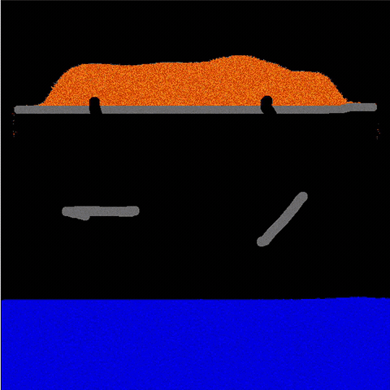
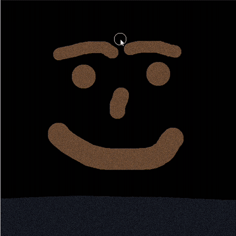
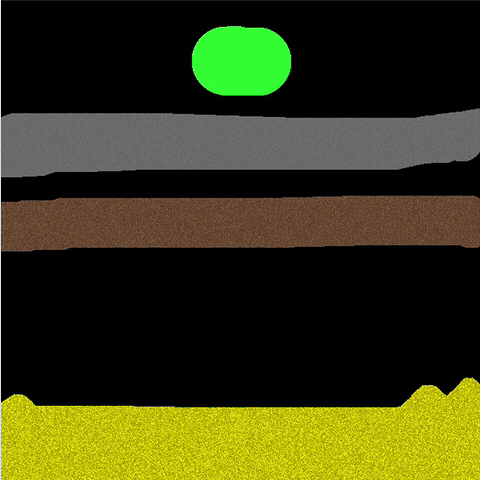

# Scree

*Scree — the sheet of loose rock fragments that mantles a slope.*

A falling-sand simulator written in C++20 with [raylib](https://github.com/raysan5/raylib).
Every pixel on the grid is an independent particle: sand piles up, water finds its
level, oil floats on top of it and burns, acid eats through stone, and lava that
touches water cools into fresh rock.

Materials are not hardcoded — they are defined in a JSON file that can be edited
and reloaded while the program is running.

<p align="center">
  
</p>

## Demo

| Fire spreading through wood | Acid eating through stone |
|:---:|:---:|
|  |  |

## Features

- **640 × 640 particle grid**, updated at 60 FPS with a configurable number of
  simulation steps per frame.
- **Chunk-based updating.** The grid is split into 32 × 32 chunks. A chunk that
  had no activity last frame is skipped entirely, and the scan jumps a full chunk
  width ahead. Chunks wake their neighbours when something moves across a border,
  so a settled pile costs nothing until you disturb it.
- **Data-driven materials.** Density, gravity direction, flammability, corrosion
  resistance, decay rate, scatter and colour range all come from
  [`Game/assets/materials.json`](Game/assets/materials.json). Adding a material is
  a JSON edit, not a code change.
- **Live reload.** Edit the JSON, press *Reload material file*, and the change is
  in the running simulation. Malformed files report an error in the UI instead of
  crashing.
- **Density-based interaction.** Movement is decided by comparing densities rather
  than by special-casing pairs, so oil floats on water, water sinks through smoke,
  and anything heavier than a fluid sinks through it.
- **Reactions.** Fire spreads to flammable neighbours, dies in water and leaves
  smoke or hot ash. Acid corrodes by material-specific chance and turns to dirty
  water. Lava ignites what it touches and quenches into hot stone, which cools
  into stone while boiling the water around it.
- **Liquid surface skimming.** Liquids on an open surface scan ahead for the
  nearest drop-off instead of shuffling one cell per step, so pools level out
  quickly rather than creeping.
- **Randomised scan order.** Each row is swept left-to-right or right-to-left at
  random, and falling particles scatter, which keeps piles from developing a
  directional bias.
- **Debug overlays.** Toggle the active-chunk grid to see what the simulation is
  actually working on, and a benchmark window for per-stage frame timings.

## Materials

| Material | Behaviour |
|---|---|
| Air | Empty space. Anything denser moves straight through it. |
| Sand | Falls and cascades into slopes. Dissolves slowly in acid. |
| Stone | Static. The default wall material. |
| Wood | Static and flammable. Burns away, and corrodes fast in acid. |
| Water | Levels out, puts out fire, and quenches lava into hot stone. |
| Dirty Water | What acid leaves behind once it has eaten something. Lighter than water. |
| Oil | Floats on water and catches fire on contact. |
| Acid | Sinks through water, corrodes its neighbours, and turns to dirty water as it does. |
| Lava | Dense liquid. Ignites what it touches and crusts into hot stone in water. |
| Fire | Rises, spreads to flammable neighbours, and dies in water. |
| Smoke | Rises and fades out. Left behind by fire. |
| Steam | Rises and fades much faster. Boiled off water by hot stone. |
| Hot Stone | Freshly quenched lava. Cools into stone, boiling the water around it. |
| Ash | Falls like sand. What burnt wood leaves behind. |
| Hot Ash | Glowing ash from a fresh burn. Cools into ash. |

## Controls

| Input | Action |
|---|---|
| **Left mouse** | Draw the selected material |
| **Right mouse** | Erase |
| **Mouse wheel** | Resize the brush (radius 1–100) |
| **Material menu** | Pick a material, pause, clear, reload materials, toggle overlays |

Dragging draws a continuous line between frames, so fast strokes don't leave gaps.
Drawing only fills empty space — erase first to replace something. The mouse is
ignored by the canvas while it is over an ImGui window.

## How it works

The grid is stored as a flat array of `Chunk`s, each holding a 32 × 32 array of
`Block`s — an integer material id plus a colour. At 640 × 640 that is a 20 × 20
grid of chunks. Colours are randomised per particle within the material's
`color_min`/`color_max` range, quantised into `steps` bands, which gives piles
texture without storing anything extra.

Each frame runs two passes over the grid: one bottom-to-top for materials that fall,
one top-to-bottom for materials that rise, so gases and liquids can move past each
other in the same tick. Within a pass, each pixel resolves in order: decay → material
reactions → falling → cascading → liquid spreading. A per-pixel processed flag stops
a particle from being updated twice after it has been swapped forward.

Chunk activity is tracked with two flags — active this frame and active next frame.
Any write marks the containing chunk for the next frame, and a write on a chunk edge
marks the neighbour too, which is what keeps interactions from stalling at chunk
boundaries.

## Adding a material

Append an entry to `Game/assets/materials.json` and reload:

```json
{
  "name": "Sand",
  "color_min": [ 150, 150, 0 ],
  "color_max": [ 255, 255, 0 ],
  "steps": 8,
  "is_fluid": false,
  "can_fall": true,
  "can_cascade": true,
  "is_liquid": false,
  "density": 80.0,
  "gravity": 1,
  "decay_chance": -1,
  "corrosion_chance": 5,
  "burn_chance": -1,
  "scatter_chance": 50
}
```

| Field | Meaning |
|---|---|
| `color_min` / `color_max` | RGB range each particle's colour is picked from |
| `steps` | Number of discrete colour bands between min and max |
| `is_fluid` | Can be displaced by denser materials moving through it |
| `can_fall` | Moves along the gravity direction |
| `can_cascade` | Slides diagonally, so it forms slopes instead of towers |
| `is_liquid` | Spreads sideways to level out |
| `density` | Decides what sinks through what |
| `gravity` | `1` falls, `-1` rises |
| `decay_chance` | Chance in 10,000 per step of vanishing; `-1` for never |
| `corrosion_chance` | Percent chance of being destroyed by adjacent acid; `-1` for immune |
| `burn_chance` | Percent chance of catching fire from a neighbour; `-1` for non-flammable |
| `scatter_chance` | Percent chance a falling particle drifts sideways |

Reactions between specific materials (acid, fire, lava, cooling) are still in code
and keyed to material names, so new materials get physics for free but not new
chemistry.

## Building

Requires **CMake 3.21+** and a **C++20** compiler. The `vs2026` preset additionally
needs a CMake new enough to know the `Visual Studio 18 2026` generator — check with
`cmake --help`. raylib, Dear ImGui, rlImGui and
nlohmann/json are pulled in automatically by `FetchContent` on first configure —
there is nothing to install by hand. They are checked out into `.deps/` at the
repository root rather than inside `build/`, so wiping a build directory does not
force a re-download.

`cmake --list-presets` shows the presets available on your platform.

**Windows (Visual Studio 2022)**

```bash
cmake --preset vs2022 && cmake --build --preset vs2022-release
```

**Windows (Visual Studio 2026)**

```bash
cmake --preset vs2026 && cmake --build --preset vs2026-release
```

**Any platform (Ninja)**

```bash
cmake --preset ninja && cmake --build --preset ninja-release
```

**Linux / macOS (Make, no Ninja required)**

```bash
cmake --preset make-release && cmake --build --preset make-release
```

Swap `release` for `debug` in any of the above. The executable lands in
`build/Game/Release/` (or `build/Game/` for the Make presets).

All presets share the `build/` directory, so **switching generators means deleting
`build/` first**. The downloaded dependencies live in `.deps/` at the repository
root and are not affected, so switching costs a reconfigure, not a re-download.

### Linux system packages

raylib builds GLFW from source and needs the X11 and audio development headers:

```bash
sudo apt install libasound2-dev libx11-dev libxrandr-dev libxi-dev \
    libgl1-mesa-dev libglu1-mesa-dev libxcursor-dev libxinerama-dev libxkbcommon-dev
```

On Fedora the equivalents are `alsa-lib-devel mesa-libGL-devel libX11-devel
libXrandr-devel libXi-devel libXcursor-devel libXinerama-devel libxkbcommon-devel`.
macOS needs only the Xcode command line tools; raylib links the system frameworks
itself.

### Assets

Assets are linked, not copied, so editing `Game/assets/materials.json` in the source
tree affects the built executable immediately with no rebuild — which is what makes
the in-app *Reload material file* button useful. The path is resolved relative to the
executable, so it works no matter what directory you launch from.

The link is made by a post-build step: a junction on Windows (`mklink /J`, which
unlike a real symlink never needs admin rights or Developer Mode), and
`cmake -E create_symlink` everywhere else.

## Roadmap

- Data-driven reactions, declared in the JSON alongside everything else
- A per-pixel heat field to replace the hot-stone / hot-ash countdown hacks, with
  ice, glass and obsidian falling out of it
- Bitmap rendering and dirty-chunk uploads, then multithreaded chunk passes
- Brush shapes, a size slider, line and rectangle tools
- Save / load worlds and image import
- A downloadable build, and a web build via Emscripten

## License

[MIT](LICENSE)
